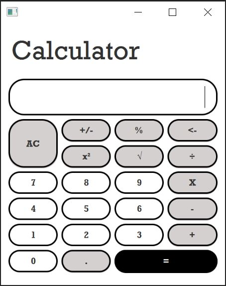

# Calculator

## Waewarin Chindarassami

### This project is completed and is archived

### Application
The application is a basic calculator. 

The following operations can be performed:
* Add
* Subtract
* Multiply
* Divide
* Equals
* Plus/Minus
* Percent
* Square
* Square Root
* Delete a digit
* Clear all (clears the current number displayed and the total accumulated up to that point)

### Purpose
The purpose of this project is to practice and develop more experience with Java and JavaFX; thus, this is a small project.

### Screenshot
</img>
